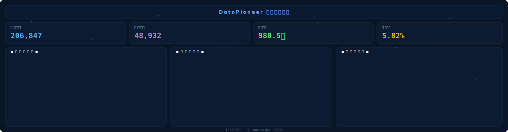

# DataPioneer — 数据先锋大屏

<p align="center">
  
  
  
</p>

<p align="center">
  <b>从 0 到 1，手把手教你打造属于自己的数据可视化大屏</b>
</p>

---

## 预览

<p align="center">
  
</p>

> 运行 `npm run dev` 查看实际效果。截图可用 Playwright 生成：
> ```bash
> npx playwright install chromium
> npx playwright screenshot --viewport-size=1920,1080 http://localhost:3000 preview.png
> ```

## 技术栈

| 类别 | 选型 |
|------|------|
| 框架 | React 18 + TypeScript |
| 构建 | Vite 5 |
| 图表 | ECharts 5 |
| 状态管理 | Zustand |
| 样式 | CSS Modules |
| 测试 | Vitest + React Testing Library + Playwright |
| 代码质量 | ESLint + Prettier + Husky + Commitlint |

## 快速开始

```bash
# 安装依赖
npm install

# 启动开发服务器（浏览器自动打开）
npm run dev

# 或双击 start.bat
```

## 项目结构

```
src/
├── adapters/          # 数据适配层 — Mock ⇄ API 一键切换
│   ├── mock/          # Mock 数据源（按时间范围生成）
│   └── api/           # API 适配器骨架
├── services/          # 业务逻辑层
├── stores/            # Zustand 状态管理
├── hooks/             # 自定义 Hooks
│   ├── useScreenScale   # 大屏等比缩放
│   ├── useCountUp       # 数字滚动动画
│   ├── useChartResize   # 图表自适应
│   └── useChartData     # 通用数据获取
├── components/        # 通用 UI 组件
│   ├── Card             # 毛玻璃卡片（去框化边框）
│   ├── StatTile         # KPI 指标卡（独立强调色）
│   ├── Header           # 大屏标题栏（居中 + 全屏按钮）
│   ├── DatePicker       # 时间范围选择器
│   ├── ParticleBg       # Canvas 粒子网络背景
│   ├── ErrorBoundary    # 错误边界
│   └── Loading          # 加载动画
├── charts/            # 6 种 ECharts 图表
│   ├── LineChart        # 趋势折线图
│   ├── BarChart         # 分类柱状图
│   ├── PieChart         # 数据环形图
│   ├── MapChart         # 中国地图（含 CDN 回退）
│   ├── GaugeChart       # 仪表盘
│   └── RadarChart       # 能力雷达图
├── layouts/           # 大屏布局
├── pages/             # 大屏页面
├── themes/            # 主题配色（5 套可选）
├── types/             # TypeScript 类型
└── utils/             # 工具函数
    ├── logger/          # 日志系统（DEBUG/INFO/WARN/ERROR）
    ├── screen/          # 屏幕适配算法
    └── formatters.ts    # 数字格式化
```

## 设计体系

### 暗夜数据美学

- **粒子背景**: 80 个随机半径粒子 + 距离连线，营造数据流动感
- **毛玻璃**: `backdrop-filter: blur(12px)` 半透明卡片
- **去框化边框**: 15% 透明蓝线 → 悬停 30% → 激活顶部光条
- **蓝紫渐变**: `#4facfe → #a18cd1` 贯穿标题、图表、KPI
- **14px 圆角**: 柔和统一
- **1920×1080 等比缩放**: `transform: scale()` 适配任意分辨率

### 五套可选主题

修改 `src/main.tsx` 中的 import 即可切换：

```ts
import './themes/dark-data-aesthetics.css';  // 暗夜数据美学（默认）
// import './themes/deep-blue.css';           // 深蓝科技风
// import './themes/cyber-neon.css';          // 暗黑霓虹风
// import './themes/business-light.css';      // 商务蓝白风
// import './themes/forest-green.css';        // 军事绿屏风
```

## Mock / API 切换

修改 `.env` 即可切换数据源，无需改动任何组件代码：

```env
VITE_DATA_SOURCE=mock   # 或 api
```

API 模式下调用 `ApiAdapter`，目前为骨架实现，填入真实接口地址即可。

## 测试

```bash
npm run test           # 41 个测试（Vitest）
npm run test:e2e       # Playwright E2E
npm run test:coverage  # 测试覆盖率
```

## 命令速查

```bash
npm run dev            # 开发服务器 → localhost:3000
npm run build          # 生产构建
npm run lint           # ESLint 检查
npm run format         # Prettier 格式化
npm run typecheck      # TypeScript 类型检查
```

## 贡献指南

1. Fork 本仓库
2. 创建功能分支 (`git checkout -b feature/xxx`)
3. 提交更改 (`git commit -m 'feat: xxx'`)
4. 推送到分支 (`git push origin feature/xxx`)
5. 打开 Pull Request

## 开源协议

[MIT License](LICENSE)
